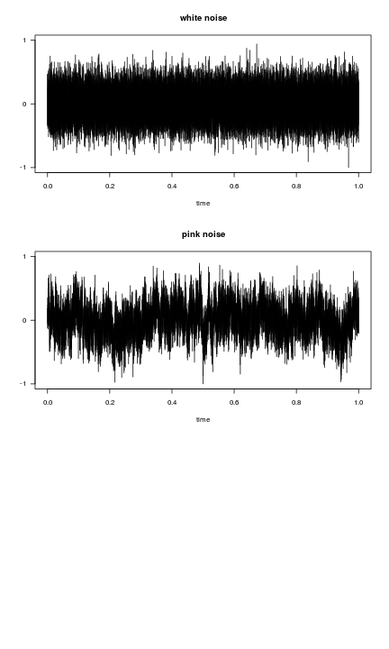

Simulating noise types (following [this](http://stackoverflow.com/questions/8697567/how-to-simulate-pink-noise-in-r))


```r
require(tuneR)

# White noise
w <- noise(kind = c("white"))

# Brown noise is integrated white noise
# (ie. random walk)
# Use same time series length as in the other series
b <- cumsum(rnorm(length(w@left)))

# Pink noise
p <- noise(kind = c("pink"))

# Visualize
par(mfrow=c(3,1))
plot(w,main="white noise")
plot(b,main="brown noise")
plot(p,main="pink noise")
```

 

Estimating Hurst exponent for the noises


```r
library(pracma)
Hwhite <- hurstexp(w@left, d = 128)
```

```
## Simple R/S Hurst estimation:         0.4936968 
## Corrected R over S Hurst exponent:   0.5136791 
## Empirical Hurst exponent:            0.5221794 
## Corrected empirical Hurst exponent:  0.5066996 
## Theoretical Hurst exponent:          0.5151584
```

```r
Hbrown <- hurstexp(b, d = 128)
```

```
## Simple R/S Hurst estimation:         0.9285047 
## Corrected R over S Hurst exponent:   1.010464 
## Empirical Hurst exponent:            1.008459 
## Corrected empirical Hurst exponent:  1.004516 
## Theoretical Hurst exponent:          0.5151584
```

```r
Hpink <- hurstexp(p@left, d = 128)
```

```
## Simple R/S Hurst estimation:         0.8094879 
## Corrected R over S Hurst exponent:   0.9094174 
## Empirical Hurst exponent:            0.9345781 
## Corrected empirical Hurst exponent:  0.9286394 
## Theoretical Hurst exponent:          0.5151584
```


