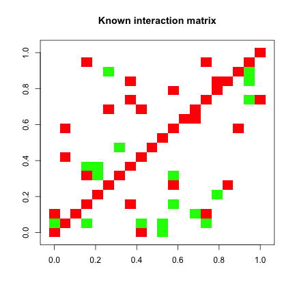
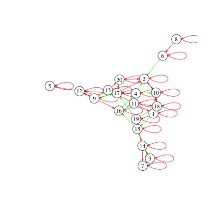
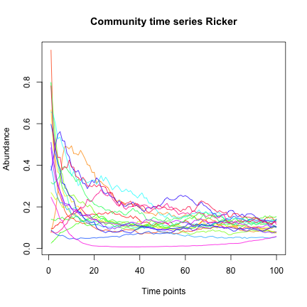
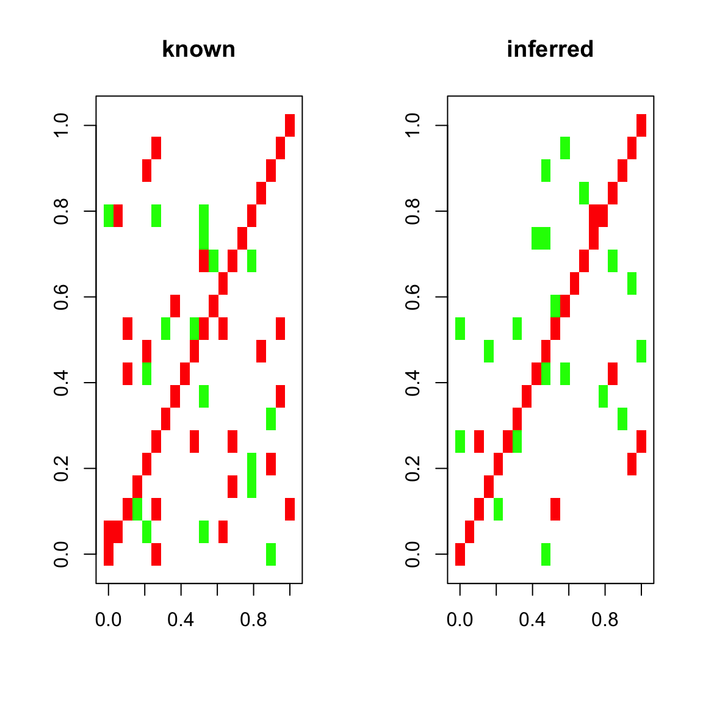
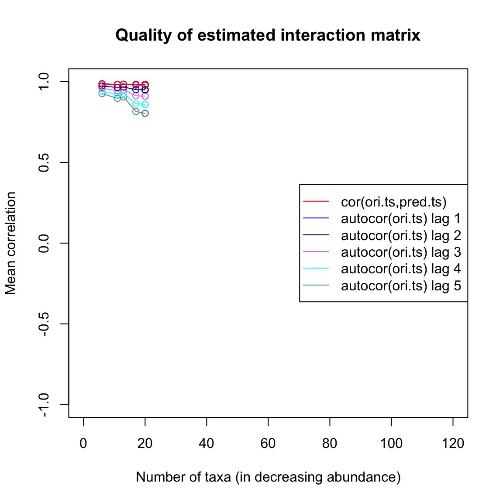
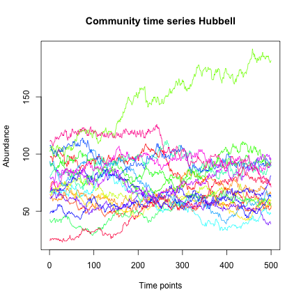
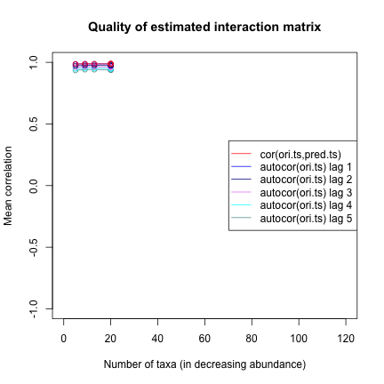

We start by loading the seqtime library.


```r
library(seqtime)
```

Next, we generate a "known" interaction matrix.


```r
N=20
A=generateA(N, c=0.1)
```

```
## [1] "Adjusting connectance to 0.1"
## [1] "Initial edge number 400"
## [1] "Initial connectance 1"
## [1] "Number of edges removed 342"
## [1] "Final connectance 0.1"
## [1] "Final connectance: 0.1"
```

```r
rownames(A)=c(1:N)
colnames(A)=rownames(A)
```

Below, we plot our known interaction matrix. Green entries stand for a positive interaction of species i with species j, whereas red entries stand for a negative interaction of species i with species j (where i and j are row and column indices, respectively). For instance, a competition consists of two red entries for the negative impact of species i on j and species j on i. The diagonal is entirely red, since the interaction matrix is generated by default with negative values on the diagonal, which represent intra-species competition.


```r
plotA(A, header="Known interaction matrix")
```

```
## [1] "Largest value: 0.471338545903563"
## [1] "Smallest value: -0.5"
```



We can also visualize the interaction matrix as a network:


```r
network=plotA(A,method="network")
```

```
## [1] "Largest value: 0.471338545903563"
## [1] "Smallest value: -0.5"
## [1] "Initial edge number 58"
## [1] "Initial connectance 0.1"
## [1] "Final connectance: 0.1"
```



```r
# use igraph's function tkplot for manual layout of the network
```

Given our interaction matrix, we simulate a test time series with Ricker:


```r
out.ricker=ricker(N,A=A)
tsplot(out.ricker,type="l",header="Ricker")
```



Now, we run LIMITS to test how well it can infer the known interaction matrix from the first hundred time points of the time series. LIMITS was developed by Fisher and Mehta (PLoS ONE 2014).
LIMITS needs a minute to run and then returns the estimated interaction matrix.


```r
Aest=limits(out.ricker,verbose=TRUE)
```

```
## [1] "Time series has 20 taxa"
## [1] "Processing first taxon."
## [1] "Processing taxon 2"
## [1] "Processing taxon 3"
## [1] "Processing taxon 4"
## [1] "Processing taxon 5"
## [1] "Processing taxon 6"
## [1] "Processing taxon 7"
## [1] "Processing taxon 8"
## [1] "Processing taxon 9"
## [1] "Processing taxon 10"
## [1] "Processing taxon 11"
## [1] "Processing taxon 12"
## [1] "Processing taxon 13"
## [1] "Processing taxon 14"
## [1] "Processing taxon 15"
## [1] "Processing taxon 16"
## [1] "Processing taxon 17"
## [1] "Processing taxon 18"
## [1] "Processing taxon 19"
## [1] "Processing taxon 20"
```

To compare the known and inferred interaction matrix, we can plot them next to each other:


```r
par(mfrow=c(1,2))
plotA(A,header="known")
```

```
## [1] "Largest value: 0.471338545903563"
## [1] "Smallest value: -0.5"
```

```r
plotA(Aest,header="inferred")
```

```
## [1] "Largest value: 1.21643673257802"
## [1] "Smallest value: -1.8311140379513"
```



```r
par(mfrow=c(1,1))
```

We can also compute the mean cross-correlation of the known and inferred interaction matrix:


```r
crossCor=cor(A,Aest)
mean(diag(crossCor), na.rm=TRUE)
```

```
## [1] 0.7515217
```

Finally, we can plot a few quality estimators for the interaction matrix inference. The quality plot displays the correlation between current and future time points one to five steps ahead (autocor) and the correlation between the original time series and a time series generated from the inferred interaction matrix step by step (cor). We can see that the predicted time series barely outperforms lag-one auto-correlation.


```r
limitsqual=limitsQuality(out.ricker,A=Aest,plot=TRUE)
```

```
## [1] "Applying Schur decomposition"
## [1] "Initial edge number 43"
## [1] "Initial connectance 0.0605263157894737"
## [1] "Final connectance: 0.621052631578947"
```



For comparison, we can also launch LIMITS on a neutral time series, which is generated without an interaction matrix:


```r
out.hubbell=simHubbell(N=N, M=N,I=1500,d=N, m=0.1, tskip=500, tend=1000)
tsplot(out.hubbell,type="l",header="Hubbell")
```




```r
Aesth=limits(out.hubbell,verbose=TRUE)
```

```
## [1] "Time series has 20 taxa"
## [1] "Processing first taxon."
## [1] "Processing taxon 2"
## [1] "Processing taxon 3"
## [1] "Processing taxon 4"
## [1] "Processing taxon 5"
## [1] "Processing taxon 6"
## [1] "Processing taxon 7"
## [1] "Processing taxon 8"
## [1] "Processing taxon 9"
## [1] "Processing taxon 10"
## [1] "Processing taxon 11"
## [1] "Processing taxon 12"
## [1] "Processing taxon 13"
## [1] "Processing taxon 14"
## [1] "Processing taxon 15"
## [1] "Processing taxon 16"
## [1] "Processing taxon 17"
## [1] "Processing taxon 18"
## [1] "Processing taxon 19"
## [1] "Processing taxon 20"
```

The quality plot shows that the inferred interaction matrix leads to a high cross-correlation between predicted and original time series, even though the model underlying the original time series does not feature an interaction matrix. Thus, a higher correlation between predicted and original time series can be misleading as an indicator for the quality of the inferred interaction matrix.


```r
limitsqualh=limitsQuality(out.hubbell,A=Aesth, plot=TRUE)
```

```
## [1] "Applying Schur decomposition"
## [1] "Initial edge number 50"
## [1] "Initial connectance 0.0789473684210526"
## [1] "Final connectance: 0.115789473684211"
```



