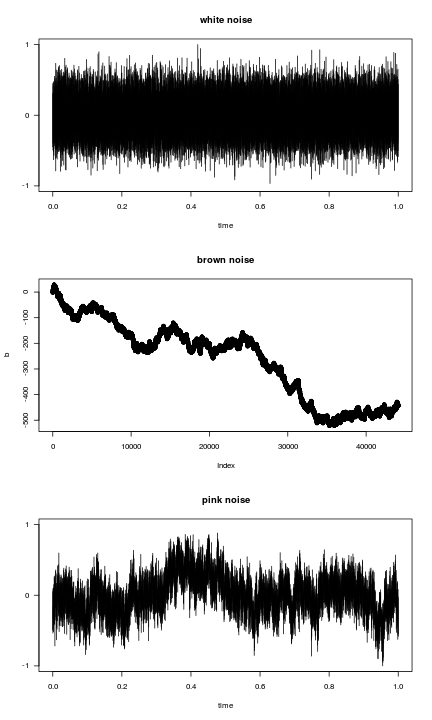

Simulating noise types (following [this](http://stackoverflow.com/questions/8697567/how-to-simulate-pink-noise-in-r))


```r
require(tuneR)

# White noise
w <- noise(kind = c("white"))

# Brown noise is integrated white noise
# (ie. random walk)
# Use same time series length as in the other series
b <- cumsum(rnorm(length(w@left)))

# Pink noise
p <- noise(kind = c("pink"))

# Visualize
par(mfrow=c(3,1))
plot(w,main="white noise")
plot(b,main="brown noise")
plot(p,main="pink noise")
```



Estimating Hurst exponent for the noises


```r
library(pracma)
Hwhite <- hurstexp(w@left, d = 128)
```

```
## Simple R/S Hurst estimation:         0.5172526 
## Corrected R over S Hurst exponent:   0.5258927 
## Empirical Hurst exponent:            0.4964159 
## Corrected empirical Hurst exponent:  0.4814666 
## Theoretical Hurst exponent:          0.5151584
```

```r
Hbrown <- hurstexp(b, d = 128)
```

```
## Simple R/S Hurst estimation:         0.9226267 
## Corrected R over S Hurst exponent:   1.015321 
## Empirical Hurst exponent:            1.006903 
## Corrected empirical Hurst exponent:  1.002952 
## Theoretical Hurst exponent:          0.5151584
```

```r
Hpink <- hurstexp(p@left, d = 128)
```

```
## Simple R/S Hurst estimation:         0.857657 
## Corrected R over S Hurst exponent:   0.9528515 
## Empirical Hurst exponent:            0.9745749 
## Corrected empirical Hurst exponent:  0.9685578 
## Theoretical Hurst exponent:          0.5151584
```


