We start by loading the seqtime library.


```r
library(seqtime)
```

Then, we generate a time series with Ricker's model. For this, we have to specify the number of species in the community as well as the interaction matrix that describes
their interactions. We generate an interaction matrix with a specified connectance c at random. The diagonal values, which represent intra-species competition, are set to a negative value. In addition, we introduce a high percentage of negative edges to avoid explosions.


```r
N=50
A=generateA(N, c=0.1, d=-1)
```

```
## [1] "Adjusting connectance to 0.1"
## [1] "Initial edge number 2500"
## [1] "Initial connectance 1"
## [1] "Number of edges removed 2205"
## [1] "Final connectance 0.1"
## [1] "Final connectance: 0.1"
```

```r
A=modifyA(A,perc=70,strength="uniform",mode="negpercent")
```

```
## [1] "Initial edge number 295"
## [1] "Initial connectance 0.1"
## [1] "Converting 206 edges into negative edges"
## [1] "Final connectance: 0.1"
```

```r
# Generate a matrix using the algorithm by Klemm and Eguiluz to simulate a species network with a realistic structure. This takes a couple of minutes to complete.
#A=generateA(N, type="klemm", c=0.1)
```

The code below visualizes the species network encoded in A. Each node
has a self-arc, which represents intra-species competition.


```r
A.graph=graph.adjacency(A,mode="directed",weighted=TRUE)
plot(A.graph,layout=layout.grid(A.graph))
```

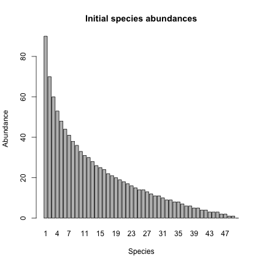

Now we generate uneven initial species abundances, summing to a total count of 1000.


```r
y=round(generateAbundances(N,mode=5))
names(y)=c(1:length(y))
barplot(y,main="Initial species abundances",xlab="Species",ylab="Abundance")
```

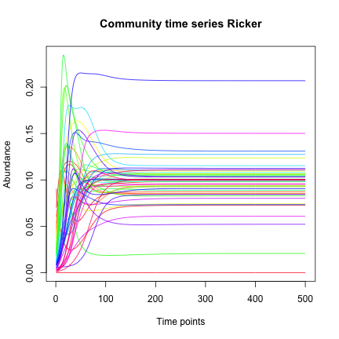

With the initial abundances and the interaction matrix, we can run the simulation with Ricker and plot the resulting time series. We convert the initial abundances in proportions and remove the noise term by assigning a negative value to sigma.


```r
out.ricker=ricker(N,A=A,y=(y/sum(y)),K=rep(0.1,N), sigma=-1,tend=500)
tsplot(out.ricker,type="l",header="Ricker")
```

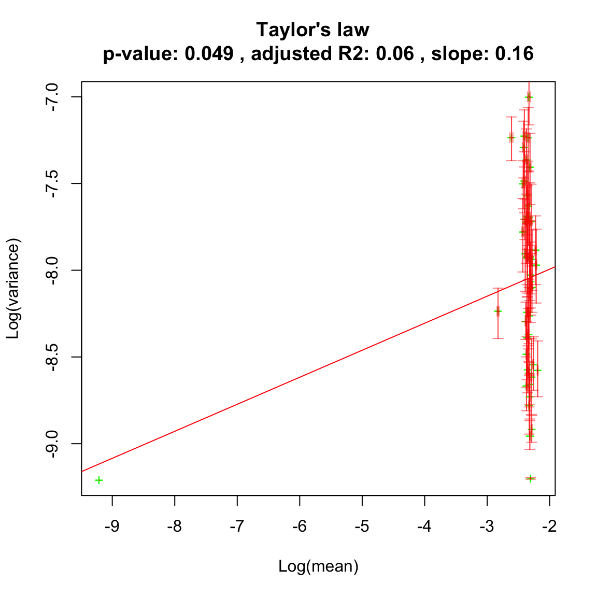

We can then analyse the community time series. First, we plot for each species
the mean against the variance. If a straight line fits well in log scale,
the Taylor law applies.


```r
# the pseudo-count allows to take the logarithm of species hat went extinct
ricker.taylor=seqtime::taylor(out.ricker, pseudo=0.0001, col="green", type="taylor")
```

```
## [1] "Adjusted R2: 0.10252735073146"
```

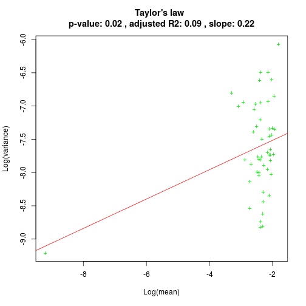

Now we look at the noise types of the species simulated with the Ricker model. In this case, the only noise type that is clearly identified is black noise.


```r
ricker.noise=identifyNoisetypes(out.ricker, abund.threshold = 0)
```

```
## [1] "Number of taxa below the abundance threshold:  1"
## [1] "Number of taxa with non-significant power spectrum laws:  0"
## [1] "Number of taxa with non-classified power spectrum:  0"
## [1] "Number of taxa with white noise:  0"
## [1] "Number of taxa with pink noise:  0"
## [1] "Number of taxa with brown noise:  0"
## [1] "Number of taxa with black noise:  49"
```

```r
plot(ricker.noise)
```

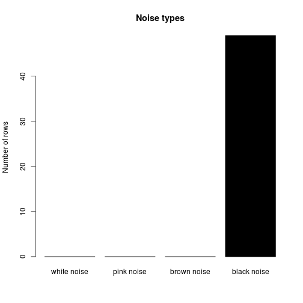

Next, we run the SOI model on the same interaction matrix and initial abundances. For the example, we run it with only 500 individuals and 100 generations.


```r
out.soi=soi(N, I=500, A=A, m.vector=y, tend=100)
tsplot(out.soi,type="l",header="SOI")
```

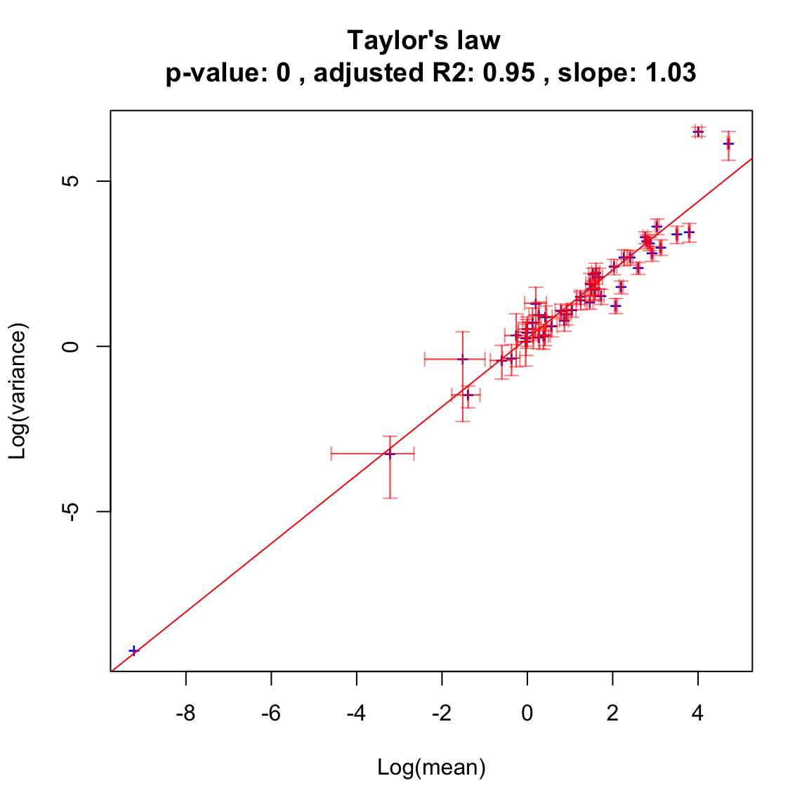

The Taylor law fits far better to species generated with SOI than with Ricker according to the adjusted R2.


```r
soi.taylor=seqtime::taylor(out.soi, pseudo=0.0001, col="blue", type="taylor")
```

```
## [1] "Adjusted R2: 0.96370576165585"
```

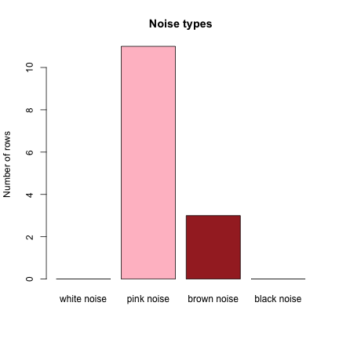

When we compute noise types in the community time series generated with SOI, we find that pink noise dominates.


```r
soi.noise=identifyNoisetypes(out.soi,abund.threshold=0)
```

```
## [1] "Number of taxa below the abundance threshold:  1"
## [1] "Number of taxa with non-significant power spectrum laws:  12"
## [1] "Number of taxa with non-classified power spectrum:  21"
## [1] "Number of taxa with white noise:  0"
## [1] "Number of taxa with pink noise:  12"
## [1] "Number of taxa with brown noise:  4"
## [1] "Number of taxa with black noise:  0"
```

```r
plot(soi.noise)
```

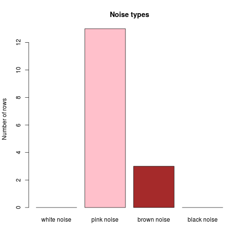

Next, we generate a community time series with the Hubbell model, which describes neutral community dynamics. We set the number of species in the local and in the meta-community as well as the number of deaths to N and assign 1500 individuals. The immigration rate m is set to 0.1. We skip the first 500 steps of transient dynamics. 


```r
out.hubbell=simHubbell(N=N, M=N,I=1500,d=N, m.vector=(y/sum(y)), m=0.1, tskip=500, tend=1000)
tsplot(out.hubbell,type="l",header="Hubbell")
```

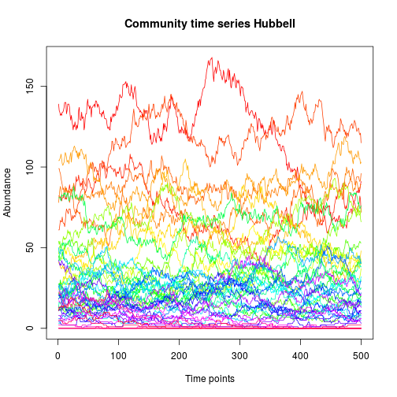

The neutral dynamics fits the Taylor law well:


```r
hubbell.taylor=seqtime::taylor(out.hubbell, pseudo=0.0001, col="blue", type="taylor")
```

```
## [1] "Adjusted R2: 0.880523541309276"
```

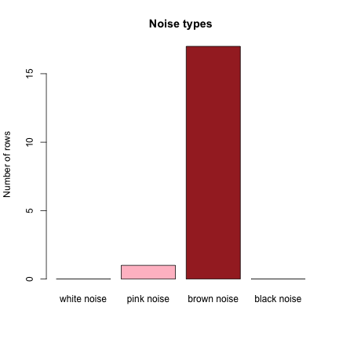

The Hubbell time series is dominated by brown noise:


```r
hubbell.noise=identifyNoisetypes(out.hubbell,abund.threshold=0)
```

```
## [1] "Number of taxa below the abundance threshold:  1"
## [1] "Number of taxa with non-significant power spectrum laws:  0"
## [1] "Number of taxa with non-classified power spectrum:  30"
## [1] "Number of taxa with white noise:  0"
## [1] "Number of taxa with pink noise:  0"
## [1] "Number of taxa with brown noise:  19"
## [1] "Number of taxa with black noise:  0"
```

```r
plot(hubbell.noise)
```

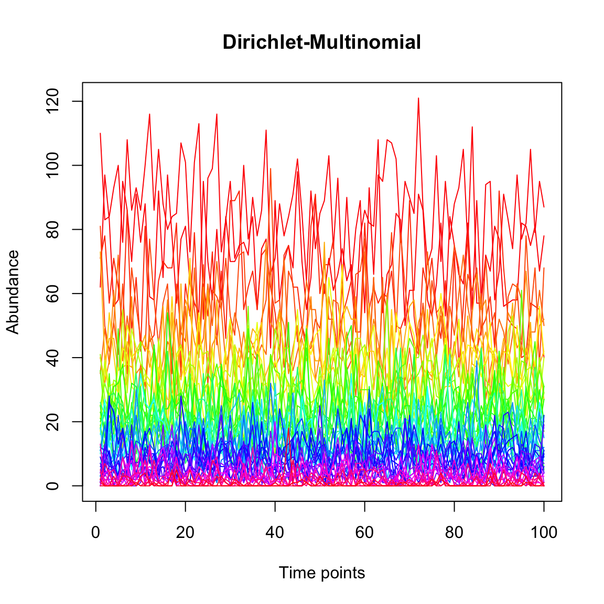


Finally, we generate a community with the Dirichlet Multinomial distribution, which in contrast to the three previous models does not introduce a dependency between time points.


```r
dm.uneven=simCountMat(N,samples=100,mode=5,k=0.05)
tsplot(dm.uneven,type="l",header="Dirichlet-Multinomial")
```

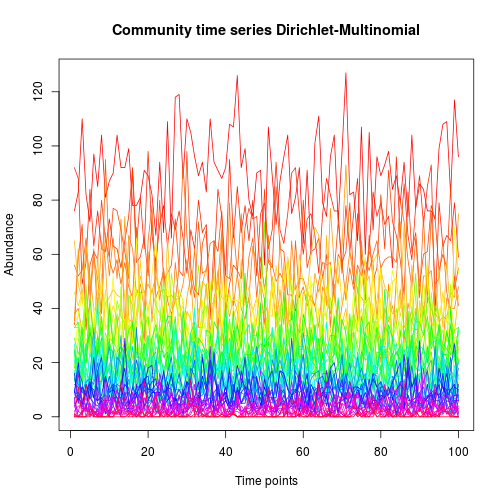


We plot its Taylor law.


```r
dm.uneven.taylor=seqtime::taylor(dm.uneven, pseudo=0.0001, col="orange", type="taylor", header="Dirichlet-Multinomial")
```

```
## [1] "Adjusted R2: 0.983171422504763"
```

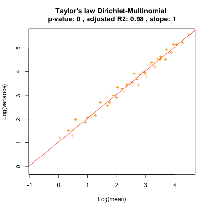

As expected, samples generated with the Dirichlet-Multinomial distribution do not display pink, brown or black noise. 


```r
dm.uneven.noise=identifyNoisetypes(dm.uneven,abund.threshold=0)
```

```
## [1] "Number of taxa below the abundance threshold:  0"
## [1] "Number of taxa with non-significant power spectrum laws:  48"
## [1] "Number of taxa with non-classified power spectrum:  2"
## [1] "Number of taxa with white noise:  0"
## [1] "Number of taxa with pink noise:  0"
## [1] "Number of taxa with brown noise:  0"
## [1] "Number of taxa with black noise:  0"
```

```r
plot(dm.uneven.noise)
```

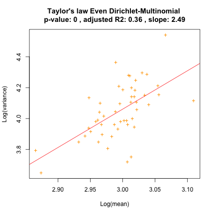

The evenness of the species proportion vector given to the Dirichlet-Multinomial distribution influences the slope of the Taylor law:


```r
dm.even=simCountMat(N,samples=100,mode=1)
dm.even.taylor=seqtime::taylor(dm.even, pseudo=0.0001, col="orange", type="taylor", header="Even Dirichlet-Multinomial")
```

```
## [1] "Adjusted R2: 0.10016796993011"
```

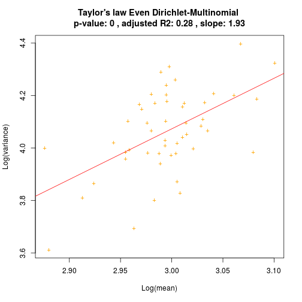


## Noise simulation

For further examples on simulating noise, see [noise_simulations.md](noise_simulations.md).
